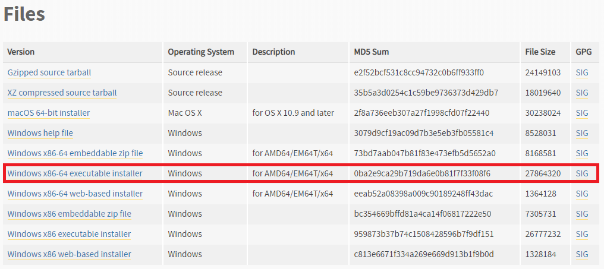
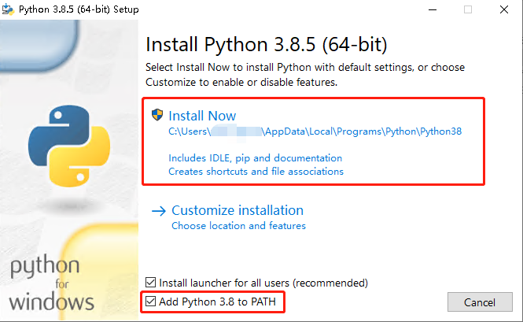
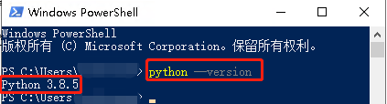
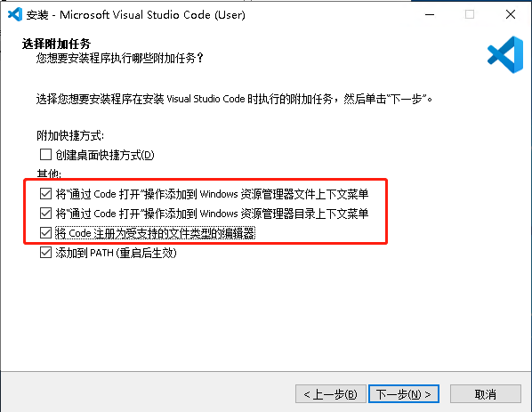

## 第一课 给你的Windows10安装Python和VSCode

### 分别前往Pyhton和VSCode的官网下载安装包

> 养成去软件官网下载软件的习惯，这很重要！

- Python官网windows版本下载页面：[链接](https://www.python.org/downloads/windows/)
    
    选择下载 `Windows x86-64 executable installer`

- VSCode官网下载页面：[链接](https://code.visualstudio.com/Download)

### 安装Python

执行我们下载的python安装程序，按照指引完成安装。

> 记得勾选`Add Python to PATH`,这样我们就不用再配置环境变量直接在CMD或者PowerShell直接执行Pyhton。

### 验证Python安装

打开CMD或者PowerShell然后执行`python --version`，如果输出版本号则说明python已经安装成功！

### 安装VSCode

执行VSCode安装程序，按照指引完成安装。

> 可以按需勾选下图红色方框的附加任务，在文件资源管理器右键选择通过VSCode打开的功能非常实用哦~

### Python Hello World

请看：[链接](https://github.com/HDCodePractice/MakePythonProject/blob/master/%E7%AC%AC%E4%B8%80%E8%AF%BE%20%E5%AE%89%E8%A3%85Python%E5%92%8CVSCode.md#python-hello-world)